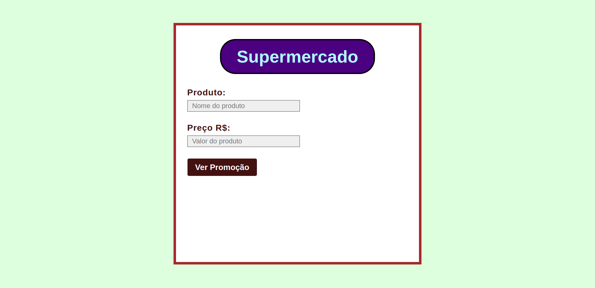
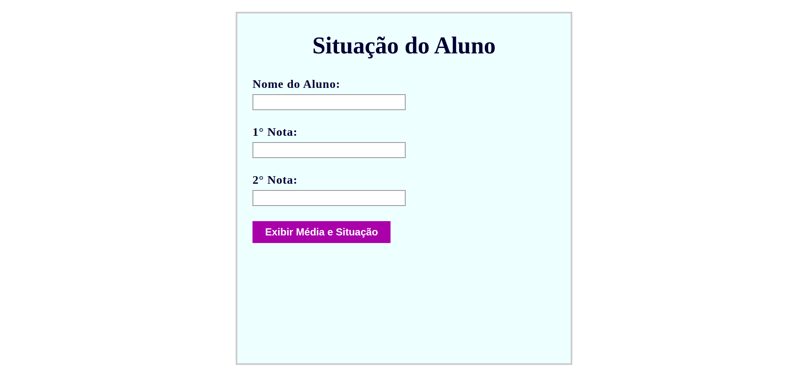

# Exercícios de Lógica de Programação e Algoritmos com JavaScript

Este repositório contém vários programas em JavaScript, com manipulação do DOM. Esses programas são exercícios do livro “Lógica de Programação e Algoritmos com JavaScript (editora: Novatec, autor: Edécio Fernando Lepsen).

## Visão Geral

- **Programa 1:** Cumprimenta o usuário, utilizando o nome recebido no input.

- **Programa 2:** Lê o título e a duração de um filme em minutos. Exiba o título do filme e converta a duração para horas e minutos.

- **Programa 3:** O programa lê o modelo e preço do veículo. Depois apresenta como resposta o valor da entrada(50%) e o restante do valor em 12x.

- **Programa 4:** Lẽ o preço por kg e o consumo (em grmas) de um cliente. Depois exibe o valor a ser pago.

- **Programa 5:** Na compra de duas unidades de um mesmo medicamento, o cliente recebe como desconto os centavos do valor total.

- **Programa 6:** Lẽ o valor de cada 15 minutos de uso de um computador e o tempo de uso por um cliente em minutos. Depois informa o valor a ser pago pelo cliente, sabendo que as frações extras de 15 minutos devem ser cobradas de forma integral.

- **Programa 7:** Cada etiqueta de produto exibi uma mensagem anunciando 50% de desconto (para um item) na compra de três unidades do produto.

- **Programa 8:** Calcula a média de nota do aluno, e confirma se o aluno foi aprovado ou não.

- **Programa 9:** Calcula o IMC (índice de massa corporal) do sexo masculino e também o feminino.

- **Programa 10:** Calcula o fuso horário da França em relação ao Brasil.

- **Programa 11:** Lê um número e calcula sua raiz quadrada.

- **Programa 12:** Em um determinado momento do dia, apenas notas de 10, 50 e 100 estão disponíveis em um caixa eletrónico. O programa lê o valor de saque do cliente, verifica se pode ser pago com as notas disponíveis e informa as notas que serão sacadas.

- **Programa 13:** Lê um número e informa se é par ou ímpar.

- **Programa 14:** Lê a velocidade permitida em uma estrada ea velocidade do condutor. Se a velocidade for inferior ou igual à permitida, exiba "Sem multa". Se a velocidade for de até 20% maior que a permitida, exiba "Multa Leve". E, se a velocidade for superior a 20% da velocidade permitida, exiba "Multa Grave".

- **Programa 15:** Simulação de um parquímetro. Lê o valor da moeda depositada no terminal de estacionamento rotativo. O programa informa o tempo de permanência do veículo no local e o troco (se existir). O valor não pode ser inferior a R$1,00

- **Programa 16:** Lẽ os três números e verifica se eles podem ou não formar um triângulo: Equilátero(3 lados iguais), Isósceles(2 lados iguais) e Escaleno (3 lados diferentes).

- **Programa 17:** Exibe a tabuada de um número selecionado pelo usuário.

  
## Como Usar

Clone este repositório em sua máquina, depois abra o arquivo `index.html` no seu navegador para visualizar localmente.

```bash
git clone https://github.com/leandropereira-dev/logic-and-algorithm-exercises.git 
